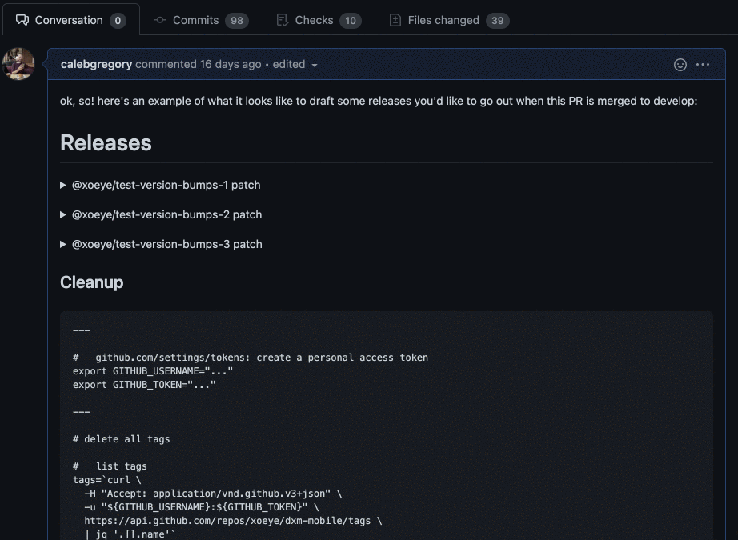
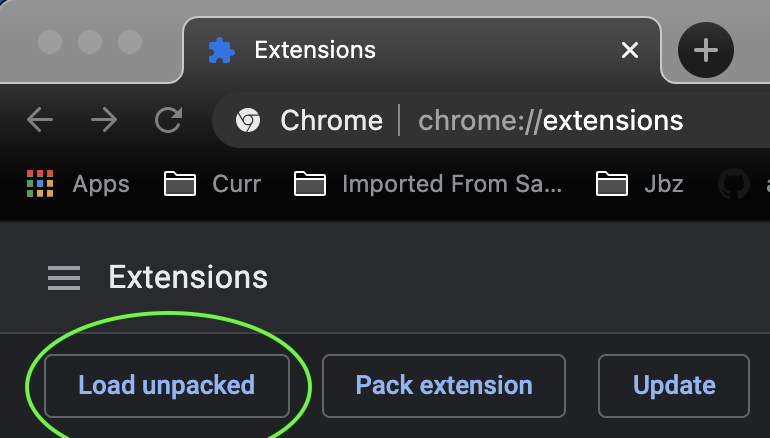

# github-firacode

A chrome extension that brings [FiraCode](https://github.com/tonsky/FiraCode) font to github's code blocks.

__This fork provides Fira Code in Github comment `<textarea>`s, including PR Descriptions.__



## To install

Clone this repository:

```sh
git clone git@github.com:calebgregory/github-firacode.git
```

Add it as a local Chrome extension:

1. Visit `chrome://extensions` in your browser
2. Click **Load Unpacked**

3. Select this repository as the directory to load
4. Refresh the Github browser tab, if you have one open
5. Enjoy!
